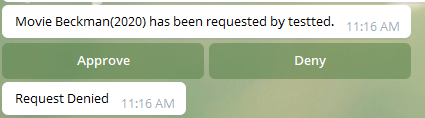
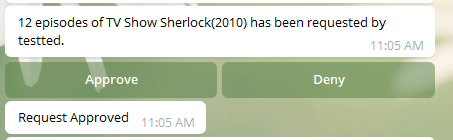

# ombi-request-bot

Simple bot for handling request approval directly inside Telegram.  For those admins
with very demanding users...  When a user makes a requuest, a notifications will show
in a telegram channel.  Click Approve or Deny.  Simple as that!

It runs in a docker container...





## How to run

### Docker

```
docker run -d -p 4322:4322 --env OMBI_URL=https://my-ombi-site --env OMBI_TOKEN=abc123 --env TELEGRAM_TOKEN=123456 --env TELEGRAM_CHAT_ID=abcdef --name ombi-request-bot tedkulp/ombi-request-bot
```


### Docker Compose

```
version: '2'
services:
  ombi-request-bot:
    image: tedkulp/ombi-request-bot
    restart: unless-stopped
    container_name: ombi-request-bot
    ports:
      - 4322:4322
    environment:
      - OMBI_URL=https://my-ombi-site
      - OMBI_TOKEN=abc123
      - TELEGRAM_TOKEN=123456
      - TELEGRAM_CHAT_ID=abcdef
```
